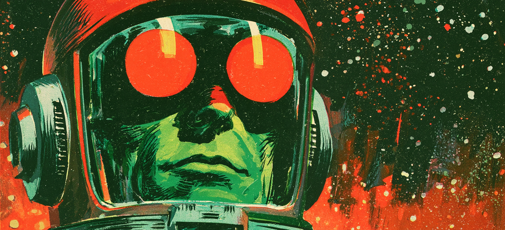

# AI-Assisted Large-Scale Scientific Software Development

{ width="100%" }

This workshop focuses on the practical use of AI-assisted
methods in the development, optimisation, and maintenance of large-scale
scientific software.

As scientific codes grow in complexity and scale, AI-based
tools—such as code assistants and autonomous agents—offer new opportunities to
improve productivity, performance, and code quality. At the same time, their
effective use in HPC and research environments requires careful consideration
of correctness, reproducibility, and performance.

Rather than emphasising highly complex or fully autonomous problem-solving,
the workshop focuses on lowering the barrier to entry and demonstrating how AI
tools can already support everyday development tasks. The goal is to enable
participants to get started quickly and to build confidence through hands-on
experience.

The workshop emphasises practical, hands-on exploration of
AI-assisted workflows in realistic scientific computing settings, including:

* AI-assisted code development and refactoring

* Debugging and bug fixing based on
  natural-language problem descriptions

* Performance analysis and optimisation with AI
  support

* AI-assisted documentation and knowledge transfer

* Simple agent-based workflows for iterative code
  improvement

The focus is on usability, practical impact, and performance
awareness in HPC-oriented environments.

## Workshop at a glance

-   :lucide-calendar: **[Schedule](schedule.md)**

    ---

    Timetable and session overview.

-   :lucide-wrench: **[Setup](setup.md)**

    ---

    Software and accounts you need.

-   :lucide-flask-conical: **[Hands-on](hands-on/index.md)**

    ---

    Instructions for the hands-on exercises.

-   :fontawesome-brands-github: **[Example repository](https://github.com/jonaslindemann/ai_coding_example)**

    ---

    Code and prompts used in the exercises.

# Organising committee

* Jonas Lindemann, LUNARC / NAISS
* Valera Veryazov, Computational Chemistry and
* Philipp Birken, Mathematical Sciences
